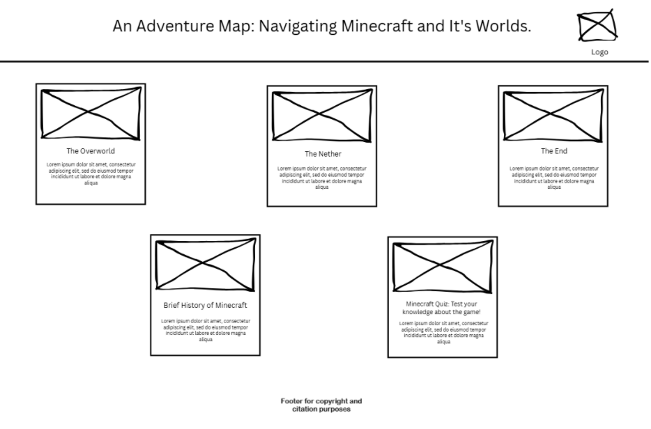
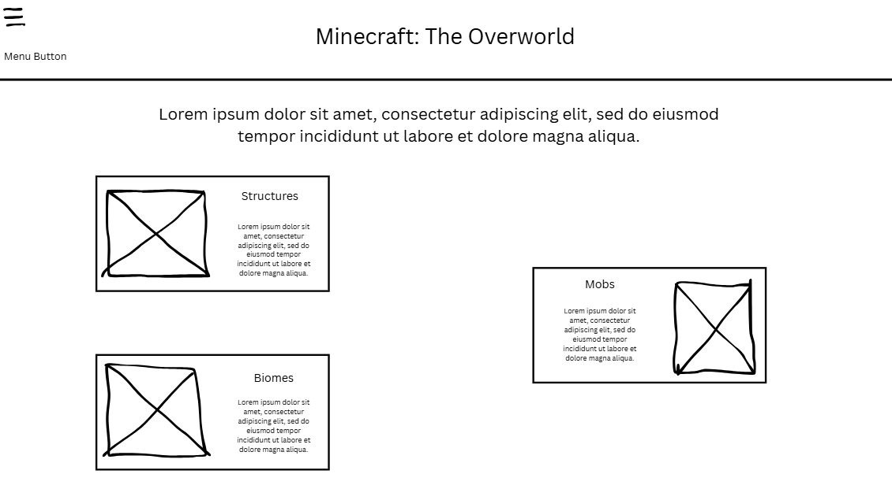
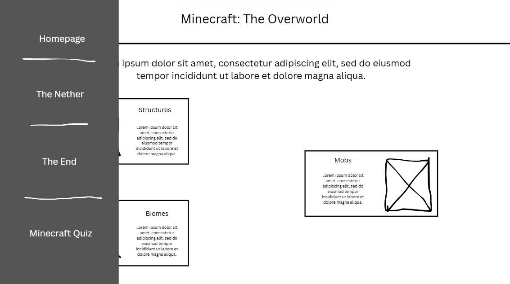
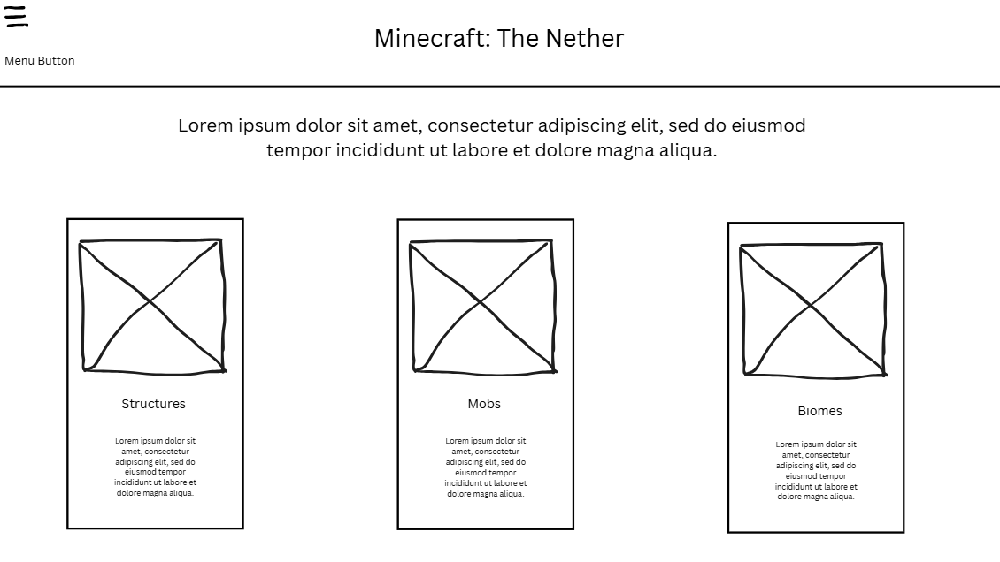
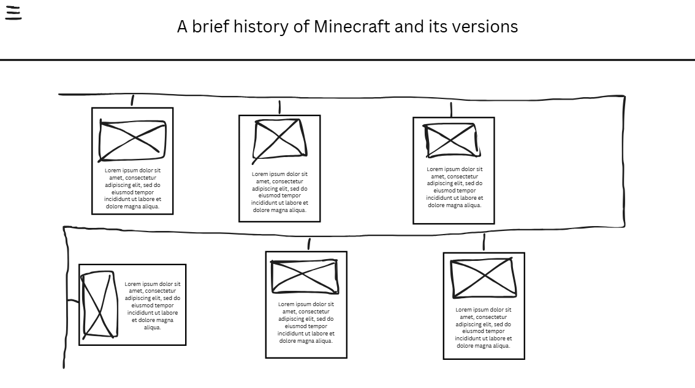
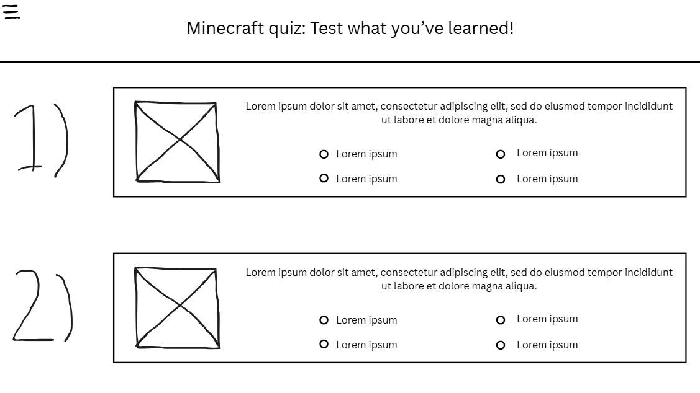

# Bucud and Salcedo project proposal
Website title: "An Adventure Map: Navigating Minecraft and It's Worlds."  

Website logo:  

  

This website aims to guide the new players of Minecraft on how they can progress deeper, accomplish quests, acquire items, explore worlds, and end the game. This serves as their guide to what things they should prioritze in order to finish the game. This website contains item guides, loot guides, map guides, mob guides, and the basuc progression of the game.  

A breakdown of the website:  

 Main page / Homepage: This is the homepage and in here, the user can traverse through the other webpages  

Overworld page: This is one of the webpages. This webpage gives a guide to the user about the mobs, structures and biomes about the overworld dimension. It will show the viewer what to do and how to progress in the overworld and get to the nether.  

Nether page: This is one of the webpages. This webpage gives a guide to the user about the mobs, structures and biomes about the nether dimension. It will show the viewer what to do and how to progress in the nether and get to the end.  

 End page: This is one of the webpages. This webpage gives a guide to the user about the mobs, structures and about the end dimension. It will show the viewer what to do and how to progress in the end.  

Quiz page: This is one of the webpages. This webpage aims to test the viewer's knowledge on the game and see what parts they're knowledgeable at and what parts of the game they need to work on their knowledge on.  

 History/development of the game page: This is one of the webpages. This webpages gives a brief introduction to Minecraft and its history, showing a lot of its versions up to the present.  

 Note: We will be using JS for things like hovering effects and for the quiz page, a lot of it will use JS to function. For example, in the quiz, we will be using JS to check if this answer is the correct one or not. Another example is incorporating a score system with the help of JS.  

Wireframes:  

Homepage:   

Overworld page:   

Overworld page (when expanding the menu): 

Nether page:   

End page:   

History of the game page:   

Quiz page:   

Note: The footer for copyright purposes, the website logo and the menu that will easily allow the user to go to the other webpages can be found in all webpages on the website.
