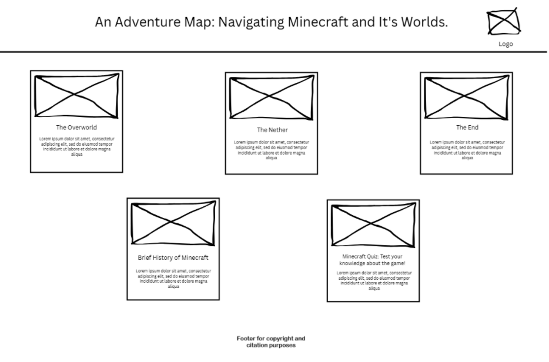
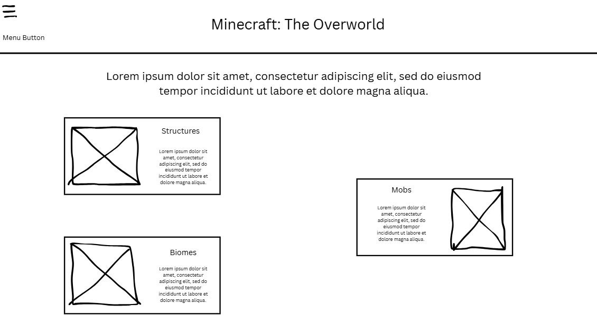
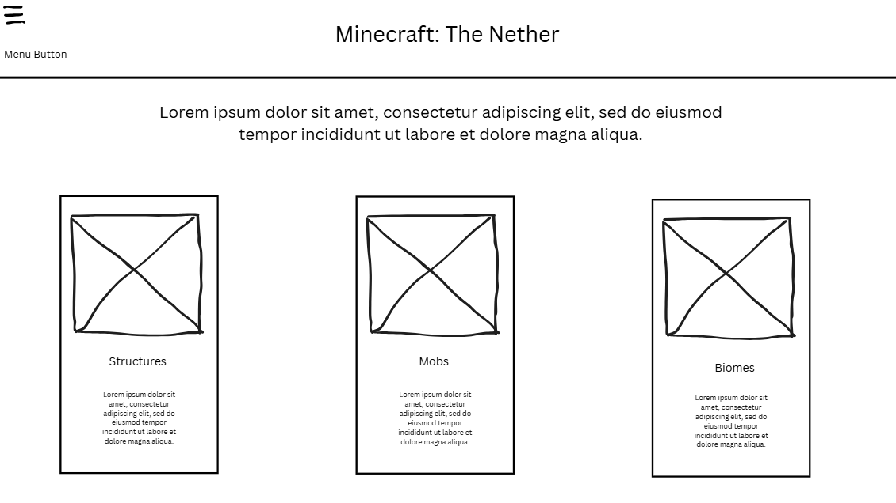
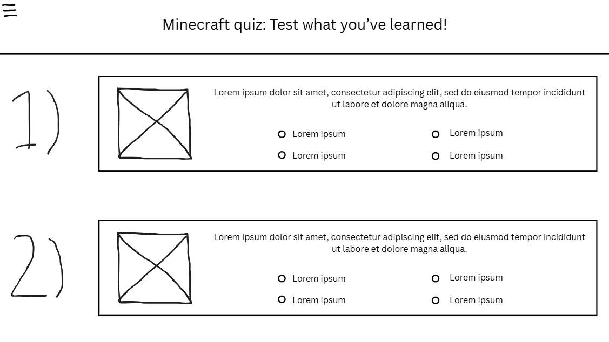
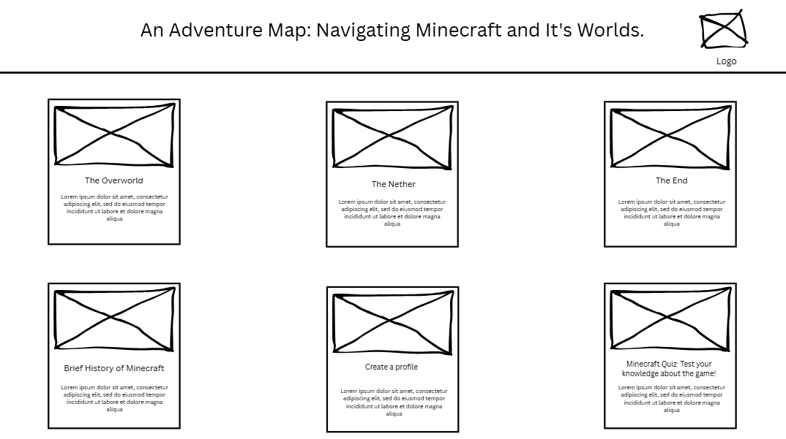
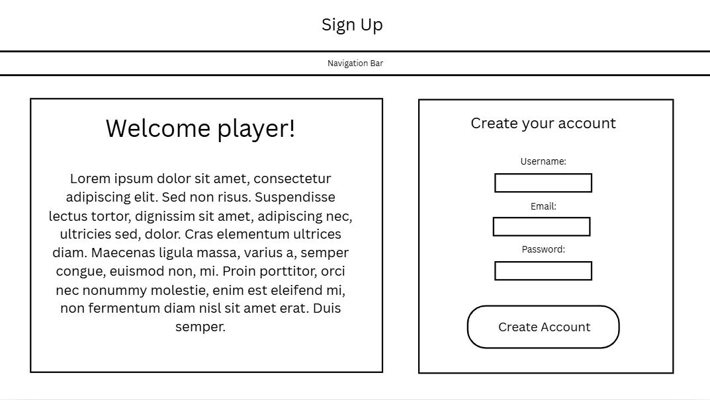
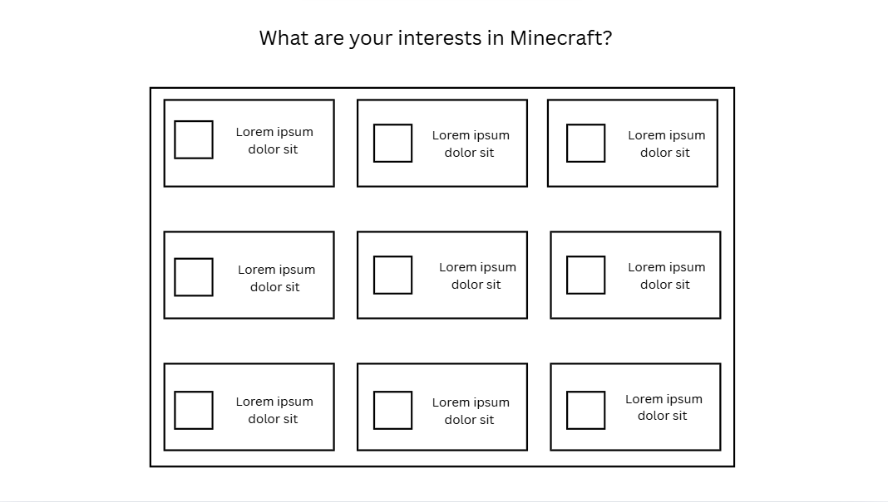
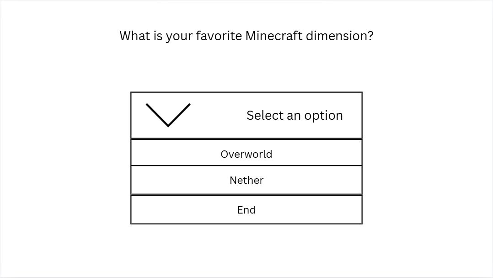
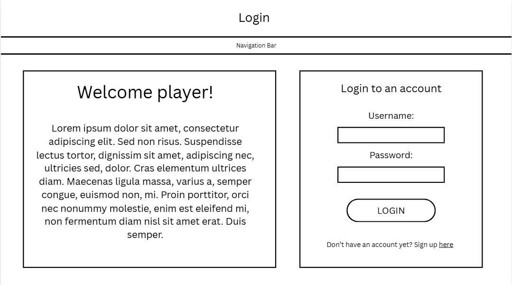

# Bucud and Salcedo project proposal
Website title: "An Adventure Map: Navigating Minecraft and It's Worlds."  

Website logo:  

[Logo](assets/minecraft.png)  

This website aims to guide the new players of Minecraft on how they can progress deeper, accomplish quests, acquire items, explore worlds, and end the game. This serves as their guide to what things they should prioritze in order to finish the game. This website contains item guides, loot guides, map guides, mob guides, and the basuc progression of the game.  

A breakdown of the website:  

 Main page / Homepage: This is the homepage and in here, the user can traverse through the other webpages  

Overworld page: This is one of the webpages. This webpage gives a guide to the user about the mobs, structures and biomes about the overworld dimension. It will show the viewer what to do and how to progress in the overworld and get to the nether.  

Nether page: This is one of the webpages. This webpage gives a guide to the user about the mobs, structures and biomes about the nether dimension. It will show the viewer what to do and how to progress in the nether and get to the end.  

 End page: This is one of the webpages. This webpage gives a guide to the user about the mobs, structures and about the end dimension. It will show the viewer what to do and how to progress in the end.  

Quiz page: This is one of the webpages. This webpage aims to test the viewer's knowledge on the game and see what parts they're knowledgeable at and what parts of the game they need to work on their knowledge on.  

 History/development of the game page: This is one of the webpages. This webpages gives a brief introduction to Minecraft and its history, showing a lot of its versions up to the present.  

 Note: We will be using JS for things like hovering effects and for the quiz page, a lot of it will use JS to function. For example, in the quiz, we will be using JS to check if this answer is the correct one or not. Another example is incorporating a score system with the help of JS.  

Wireframes:  

Homepage:   

Overworld page:   

Overworld page (when expanding the menu): 

Nether page:   

End page:   

History of the game page:   

Quiz page:   

Note: The footer for copyright purposes, the website logo and the menu that will easily allow the user to go to the other webpages can be found in all webpages on the website.

# Q3 Updated Proposal

## Design and narrative on the HTML form and webpages:

 For our updated website, we have decided to include 3 new webpages. The most important webpage here is the sign-up page. This webpage allows the user to create a profile by asking for various information with the use of dropdown boxes and check boxes. The information asked from the user are their username, password and other interesting Minecraft facts about them (such as favorite biome, playstyle, etc.). After the user fills in the required data in the sign-up page, the data will get saved on the user's computer using local storage. The main purpose of the HTML form in our website is to store content from the user and display it on other webpages on our website.

 The data obtained from the sign-up page will be used in our other new webpages, which are the login and player profile pages.

 In the login page, the user is able to login to their account by inputting the password and username which were saved in the sign-up page. The user will be able to access the player profile page ONLY if they have successfully logged in. 

 The profile page is divided into 2 sections. The first one shows the user's username and profile picture. The other section shows the user the data which about the other interesting Minecraft facts about them they've inputted in the sign-up page such as their favorite dimension, skills and more.

 Note: The player can actually choose their profile picture in the profile page, not in the sign-up page.

## Wireframes

Updated main webpage: 

This shows an updated version of the website's main homepage, which adds the sign-up page.

### Wireframes for sign-up page

 Username and password:

 Additional info:  

 This utilizes dropdown boxes and checkboxes, as mentioned earlier.

### Wireframes for login page

 

 This is similar to the sign-up webpage. We added a section which contains images of the creators of the website and a button showing terms and consent.

### Wireframes for profile page

 

 This shows what we stated earlier. The webpage is divided into 2 parts. One part shows your username and profile picture, while the other part shows additional Minecraft info about you.

 

